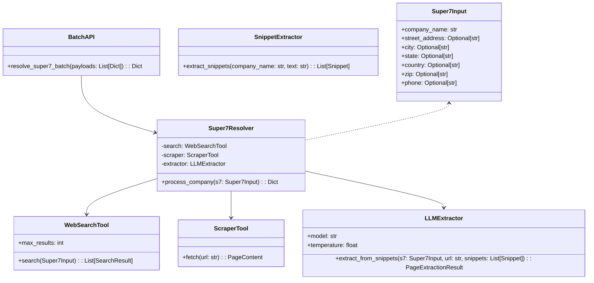
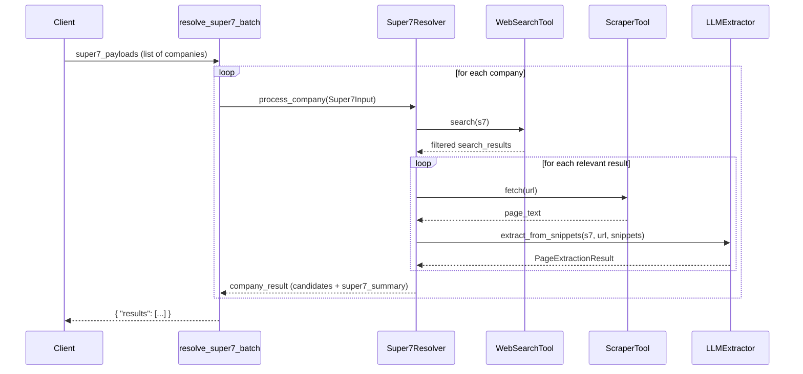

# Super7 URL & Company Resolver

## 🔍 Goal

Given only a **company name** (and optional hints like city / country / phone), automatically:

- Discover relevant web pages about that company  
- Extract the **Super7 identity elements**  
- Return a clean and auditable **JSON summary** containing:
  - Best value per field  
  - Supporting source URLs  
  - Normalized confidence score ∈ `[0, 1]`

---

# 1. The Super7 Problem

In KYC, AML, credit risk, fraud detection, onboarding, and enrichment pipelines, we repeatedly need the same **basic company identity profile**:

1. `company_name`
2. `street_address`
3. `city`
4. `state`
5. `country`
6. `zip`
7. `phone`

## 1.1 The Hard Reality

- Many companies share similar names  
- Data is spread across:
  - Official websites  
  - Government / registry pages  
  - Industry directories  
  - Random blogs, PDFs, and news articles  
- Search engines happily return **mixed** results:
  - Different companies  
  - Lawsuits / obituaries  
  - DNB pages  
  - Social profiles  
  - Sale deeds, court notes  

### 🎯 Our Goal  

A **precision-first Super7 resolver** that:

- **Never** confidently returns the *wrong* company’s address/phone  
- Tracks provenance via `source` and `all_sources`  
- Produces a human-auditable JSON result with **scores and reasons**  

---

# 2. Visual Architecture Overview

This section gives a visual understanding of how the system works end-to-end.

## 2.1 High-Level Architecture (A)

```mermaid
flowchart LR
    A[Super7Input<br/>company_name + hints] --> B[Build Search Queries]
    B --> C[WebSearchTool<br/>(Tavily)]
    C --> D[Filtered Search Results]
    D --> E[ScraperTool<br/>Docling + BeautifulSoup]
    E --> F[Raw Page Text]
    F --> G[SnippetExtractor<br/>name + regex windows]
    G --> H[LLMExtractor<br/>OpenAI JSON extraction]
    H --> I[Candidate Records<br/>(entities + page scores)]
    I --> J[Super7 Summarizer<br/>per-field scoring]
    J --> K[Final Super7 JSON<br/>value + source + confidence]
```

## 2.2 Component Architecture Diagram (C)



## 2.3 Request / Response Sequence Diagram (E)



## 2.4 Full System Flow Diagram (B)

```mermaid
flowchart TD
    A[Start: Super7Input] --> B[Normalize company name]
    B --> C[Build search queries<br/>name + hints + phone]
    C --> D[WebSearch via Tavily]

    D --> E{Domain / title / snippet filter<br/>should_consider_search_result?}
    E -- No --> D2[Skip result]
    E -- Yes --> F[ScraperTool.fetch(url)<br/>Docling / requests + BS4]

    F --> G{doc_mentions_company?}
    G -- No --> G2[Drop page]
    G -- Yes --> H[extract_snippets_for_company]

    H --> I[LLMExtractor.extract_from_snippets]
    I --> J[CandidateRecord per URL]

    J --> K[Aggregate all candidates]
    K --> L[Same-company guard<br/>(name similarity)]
    L --> M[Per-entity scoring<br/>score_field_candidate]
    M --> N[summarize_super7_simple<br/>pick best for each field]
    N --> O[Final Super7 JSON]
    O --> P[End]
```

## 2.5 Batch Processing Flow (D)

```mermaid
flowchart LR
    A[Client<br/>list of companies] --> B[resolve_super7_batch]
    B --> C[Loop over payloads]
    C --> D[Super7Input validation]
    D --> E[Super7Resolver.process_company]
    E --> F[Per-company result<br/>primary_url + candidates + summary]
    F --> G[Append to results list]
    G --> H[Return { "results": [...] }]
```

## 2.6 Super7 Entity Selection Logic (F)

```mermaid
flowchart TD
    A[All Candidate Records<br/>(entities from all pages)] --> B[Group by Super7 field]
    B --> C[Filter out entities from excluded domains]
    C --> D[Apply same-company guard<br/>for non-name fields]
    D --> E[Compute raw score for each entity<br/>score_field_candidate]
    E --> F{Best raw_score >= 0.3?}
    F -- No --> G[Set field = null]
    F -- Yes --> H[Pick best entity as winner]
    H --> I[Normalize confidence: raw_score/2.0 -> [0,1]]
    I --> J[Build field JSON<br/>value + source + confidence + all_sources]
```

---

# 3. High-Level Architecture (Text)

The main logic lives in:

```bash
super7_docling_snippet_resolver.py
```

### Core Components

| Component           | Description                                                                 |
|---------------------|-----------------------------------------------------------------------------|
| **Super7Input**     | Pydantic (or similar) schema for input validation                          |
| **WebSearchTool**   | Tavily-based web search for candidate URLs                                 |
| **ScraperTool**     | Polite scraper using `requests.Session`, Docling, and BeautifulSoup        |
| **SnippetExtractor**| Extracts only the most relevant fragments of page text                     |
| **LLMExtractor**    | Uses OpenAI to extract structured entities from snippets                   |
| **Super7Resolver**  | Orchestrates the full pipeline for a single company                        |
| **resolve_super7_batch** | Batch interface that runs the resolver for multiple companies         |

---

# 4. End-to-End Process Flow (Detailed)

## 4.1 Step-by-Step Narrative

For each company in the batch:

1. **Accept Super7 input**
   - `company_name` (required)
   - Optional hints: `country`, `state`, `city`, `street_address`, `zip`, `phone`

2. **Build search queries**
   - Combine company name with location hints:
     - `"<name> <city> <state> <country> official website"`
     - `"<name> company"`
     - `"\"<name>\""`
     - If phone is provided: `"\"<name>\" \"<phone>\""`

3. **Run web search (Tavily) via WebSearchTool**
   - Tavily is responsible for **discovering candidate URLs** and giving us:
     - `url`
     - `title`
     - `snippet` or short `content`
   - We **do not** trust Tavily’s snippet as ground truth by itself. It is treated as:
     - A signal for *relevance*  
     - A fallback text only when full scraping fails

4. **Search-level filtering via `should_consider_search_result`**
   - Skip obviously irrelevant results:
     - Use domain blacklists (e.g., news, DNB, social)
     - Compute Jaccard similarity between normalized company name and result title
     - Or check if snippet contains the company name
   - If neither holds, we **do not scrape** the URL.

5. **Scraping & content extraction via ScraperTool (Docling-first, snippet fallback)**
   - Enforce domain blacklist
   - Skip URLs ending with document extensions:
     - `.pdf`, `.doc`, `.docx`, `.xls`, `.xlsx`, `.ppt`, `.pptx`  
       > For this Super7 use-case, we deliberately skip heavy files even though Docling can handle them.
   - Optional size guard:
     - HEAD request to enforce `max_content_length_bytes`
   - Try **Docling**:
     - `converter.convert(url) -> markdown text`
     - This gives us **clean, normalized markdown** from messy HTML, which:
       - Strips boilerplate in a smarter way
       - Produces a consistent text format for snippet extraction
   - If Docling fails, fallback to:
     - `requests.Session.get(url)`
     - `BeautifulSoup` to strip scripts/styles and extract text
   - If both scraping strategies fail and Tavily snippet exists:
     - Use **Tavily’s snippet** as a last-resort `page_text`

   This is the core **shift between Docling and Tavily**:

   - Tavily = *discovery + fallback text*  
   - Docling = *primary text normalizer for the actual page content*  

6. **Doc-level company check via `doc_mentions_company`**
   - Check if raw `company_name` appears
   - Or if the main token of a normalized name appears at least N times
   - If not, skip the page as not primarily about this company.

7. **Snippet extraction via `extract_snippets_for_company`**
   - Identify name variants:
     - Normalized
     - Original
     - `&` → `and`
   - Extract context windows around occurrences of each name variant
   - Regex-based candidates:
     - Phone numbers
     - Zip codes
     - Address-like lines (`street`, `road`, `ave`, etc. with numbers)
   - Cap at `max_snippets` per page (e.g., 25)
   - If nothing is found:
     - Take the first ~800 characters as a last-resort snippet

8. **LLM extraction per page via `LLMExtractor.extract_from_snippets`**
   - Prompt includes:
     - Super7 JSON (hints)
     - URL
     - All snippets with IDs and types
   - Model returns strict JSON with:
     - List of entities:
       - `entity_type ∈ {company_name, street_address, city, state, country, zip, phone, plus some IDs & "other"}`
       - `value`
       - `source_urls`
       - `confidence ∈ [0, 1]`
     - Page-level scores:
       - `match_score_name`
       - `match_score_address`
       - `match_score_phone`
       - `looks_like_official_site`
       - `overall_score`
       - `reason`
   - JSON parsing with fallback:
     - If needed, locate first `{ ... }` block in the LLM output
   - Ensure:
     - Confidence is clamped to `[0, 1]`
     - `source_urls` always includes the page URL

9. **Candidate page aggregation**
   - For each processed URL, we build a `CandidateRecord`:

     ```python
     CandidateRecord(
         url=url,
         source_type="web_search",
         extraction=PageExtractionResult(...),
     )
     ```

   - Track:
     - `primary_url` = URL with highest `overall_score`
     - `primary_confidence` = that score

10. **Per-field entity selection via `summarize_super7_simple`**
    - For each of the seven Super7 fields:
      - Collect entities where:
        - `entity_type == field`
        - `value` is non-empty
        - At least one `source_url` is not in excluded domains
        - For non-`company_name` fields, the page passes same-company guard

11. **Per-entity scoring logic via `score_field_candidate`**
    - Raw score:
      ```python
      raw_score = (
          ent.confidence
          + 0.5 * page.overall_score
          + (0.2 if page.looks_like_official_site else 0.0)
          + match_bonus_if_hint_matches
      )
      ```
    - `match_bonus_if_hint_matches`:
      - If Super7 had a hint for that field:
        - +0.3 for exact match
        - +0.15 for substring match
    - Keep entity with highest `raw_score` for each field
    - If best `raw_score` < 0.3:
      - Drop the field (`None`) instead of returning a weak guess.

12. **Normalization & final JSON**
    - Raw scores are roughly in range `[0, 2.0]`
    - Normalize:
      ```python
      confidence = min(max(raw_score / 2.0, 0.0), 1.0)
      ```
    - For each field output:
      ```json
      "field_name": {
        "value": "best candidate string",
        "source": "primary_source_url",
        "confidence": 0.73,
        "all_sources": ["url1", "url2", "..."]
      }
      ```
    - If no good candidate exists:
      ```json
      "field_name": null
      ```

13. **Batch response structure**
    - `resolve_super7_batch` returns:
      ```json
      {
        "results": [
          {
            "input": {...},
            "primary_url": "...",
            "primary_confidence": 0.92,
            "candidates": [
              { "url": "...", "overall_score": 0.95, "reason": "..." }
            ],
            "super7_summary": {
              "company_name": {...},
              "street_address": {...}
            }
          }
        ]
      }
      ```

---

# 5. Design Rationale – Why This Approach

## 5.1 Why not just “search → scrape → full-text LLM”?

Naively:
- Search for the company
- Scrape each URL
- Dump the entire page into the LLM
- Ask: “give me Super7”

Problems:

- **Token explosion**  
  - PDFs, large HTML, and registries can be tens of thousands of tokens  
  - Expensive and slow

- **Noise and confusion**  
  - Pages include legal disclaimers, nav menus, footers, multiple companies
  - LLM might hallucinate or pick the wrong name/phone/address

- **Wrong-company contamination**  
  - Search results often contain news, court notes, and aggregated lists
  - LLM might pick another company’s address on the same page

### Our Answer: Guardrails Everywhere

We introduce multiple guardrails, each removing a different failure mode:

- Search-level filters (title/snippet + domain)
- Domain blacklists
- Document-level company checks
- Snippet-based extraction
- Same-company guard
- Per-entity scoring with hints

---

## 5.2 Why snippet-based extraction?

We send the LLM **only** small slices of text likely to contain:

- Company name  
- Address  
- Phone  
- Zip  
- Nearby context  

**Benefits:**

- Cheaper – fewer tokens per page  
- Sharper – LLM sees less noise  
- Interpretable – we can log snippets and replay what the LLM saw  

---

## 5.3 Why evaluate each entity individually?

Each `ExtractedEntity` has:

- `entity_type` (Super7 field)
- `value`
- `source_urls`
- `confidence`

We score each entity with:

- Entity-level signal (`ent.confidence`)  
- Page-level signal (`overall_score`, `looks_like_official_site`)  
- Input hints (`s7.city`, `s7.country`, `s7.phone`, etc.)  

This allows:

- Fine-grained control over which city/phone/address we pick  
- Favoring official domains  
- Favoring values consistent with hints  

---

## 5.4 Why a “same-company” guard for non-name fields?

A page might mention multiple companies, or list multiple addresses.

For fields like `street_address`, `zip`, `phone`, we:

- Extract all `company_name` entities from the page  
- Compute name similarity between target `Super7Input.company_name` and those entities  
- If no match above threshold (e.g., 0.6), we **do not** trust the page for address/phone/zip  

This avoids picking addresses for:

- Another tenant in the same building  
- A different branch or entity on the same page  

---

## 5.5 Why exclude social / DNB / news outlets for Super7 truth?

We observed:

- DNB pages may contain multiple addresses or partial info  
- Social media often has outdated / weirdly formatted addresses  
- News frequently mentions addresses in legal/court contexts  

So, in `SUMMARY_DOMAIN_EXCLUDE`, we list domains that should **never** be used as **primary truth sources**.

They can still influence:

- Page-level scores (indirectly, via LLM)  
- Debugging and context  

But they do not become `"source"` in Super7 summary fields.

---

## 5.6 Why Docling, and how we “shift” between Docling and Tavily

There are three distinct roles in this pipeline:

1. **Tavily as a web search tool**
   - Finds *which* URLs we should look at.  
   - Provides short snippets that help us decide:
     - Is this result about our company?  
     - Is this domain blacklisted?  
   - Acts as an emergency **content fallback** only when scraping fails.

2. **Docling as the primary content normalizer**
   - Takes the actual URL and converts it to **clean markdown**.  
   - Handles messy HTML much better than naive `.text` extraction:
     - Less boilerplate  
     - Better structure  
     - More consistent signal for snippet extraction
   - For this Super7 resolver we **skip heavy PDFs/Office** for cost reasons, but Docling still:
     - Standardizes HTML content  
     - Gives us a high-quality base text for snippet logic.

3. **Fallback to Tavily snippet**
   - When:
     - Docling fails, **and**
     - `requests + BeautifulSoup` fail or are blocked  
   - We then **fall back** to Tavily’s snippet as the only text we have.  
   - In this mode, we still:
     - Run snippet extraction on the snippet text  
     - Run LLM extraction  
     - But we understand confidence may be lower, which is captured in scores.

### TL;DR

- **We use Tavily to *discover* URLs and optionally supply backup text.**  
- **We use Docling to *understand* the actual page content in a normalized way.**  
- **We “shift” to Tavily snippets only when scraping/Docling cannot give us usable content.**  

This separation of concerns is exactly what keeps the resolver:

- Robust to weird HTML  
- Less dependent on search-engine heuristics  
- Safer from noisy or truncated snippets  

---

# 6. Key Functions & Responsibilities

## 6.1 `normalize_company_name` & `jaccard_name_similarity`

**Purpose:** normalize names and compute robust similarity.

Steps:

- Lowercase  
- Replace `&` with `and`  
- Remove punctuation  
- Remove corporate suffixes (`llc`, `inc`, `ltd`, `oy`, etc.)  
- Compute Jaccard similarity over token sets  

Used in:

- `should_consider_search_result`  
- `is_page_same_company`  

---

## 6.2 `should_consider_search_result`

**Inputs:**

- Company name  
- Search result title  
- Search result snippet  

**Decision:** keep result if:

- Jaccard(title, company_name) ≥ 0.2, **or**  
- Snippet contains the company name (case-insensitive)  

Prevents scraping:

- Generic blogs  
- Irrelevant news  
- Completely unrelated results  

---

## 6.3 `doc_mentions_company`

**Inputs:**

- Company name  
- Full page text  

**Decision:**

- If raw company name appears → `True`  
- Else if main token of normalized name appears at least N times → `True`  
- Else → `False`  

If `False`, we assume the page is not primarily about this company and skip it.

---

## 6.4 `extract_snippets_for_company`

**Purpose:** turn large, noisy text into small, high-signal snippets.

Key steps:

- Name-based windows  
- Regex-based phone/zip/address extraction  
- Fallback generic snippet if nothing is found  

Only the parts of the page likely to contain identity signals go to the LLM.

---

## 6.5 `LLMExtractor.extract_from_snippets`

**Role:** prompt the LLM with:

- Super7 hints  
- URL  
- Snippets  

Ask for:

- Entities (type, value, source_urls, confidence)  
- Page-level scores & reason  

This combines **snippets + hints + strict JSON** for control and explainability.

---

## 6.6 `is_page_same_company`

**Role:** decide whether a page can be trusted for non-name fields.

Logic:

- Look at extracted `company_name` entities on that page  
- Compute name similarity vs target  
- If best similarity ≥ threshold → same company  

Prevents mixing addresses/phones for unrelated entities.

---

## 6.7 `score_field_candidate`

**Role:** assign a raw score to one entity for one field.

Signals:

- Entity confidence  
- Page relevance (`overall_score`)  
- Official site flag  
- Alignment with Super7 hints  

Outputs a `raw_score` in ~[0, 2] which is later normalized.

---

## 6.8 `summarize_super7_simple`

**Role:** for each of the 7 Super7 fields:

- Scan all entities from all candidate pages  
- Drop entities from excluded domains  
- Apply same-company guard  
- Score each candidate with `score_field_candidate`  
- Pick highest `raw_score` entity  
- Normalize to confidence `[0,1]`  
- Build final JSON entry with:
  - `value`  
  - `source`  
  - `confidence`  
  - `all_sources`  

This gives a deterministic, auditable, and tunable way to pick one best candidate per field.

---

# 7. Batch Interface & Usage

## 7.1 Batch Function

```python
from typing import Any, Dict, List

def resolve_super7_batch(super7_payloads: List[Dict[str, Any]]) -> Dict[str, Any]:
    search = WebSearchTool(max_results=5)
    scraper = ScraperTool(...)
    extractor = LLMExtractor(model="gpt-4o-mini", temperature=0.0)
    resolver = Super7Resolver(search, scraper, extractor)

    results = []
    for payload in super7_payloads:
        s7 = Super7Input(**payload)
        out = resolver.process_company(s7)
        results.append(out)

    return {"results": results}
```

## 7.2 Example Usage

```python
import json

if __name__ == "__main__":
    batch_input = [
        {"company_name": "Home Fit Solutions LLC", "country": "United States", "city": "Honesdale"},
        {"company_name": "r&k firesupport llc"},
        {"company_name": "Nexapoint Holding"},
    ]

    res = resolve_super7_batch(batch_input)
    print(json.dumps(res, indent=2))
```

---

# 8. Setup & Environment

## 8.1 Dependencies (Typical)

```text
openai
langchain-tavily
python-dotenv
requests
beautifulsoup4
pydantic
docling
```

You can manage them with:

```bash
pip install -r requirements.txt
```

## 8.2 Environment Variables

### macOS / Linux (bash/zsh)

```bash
export OPENAI_API_KEY="sk-..."
export TAVILY_API_KEY="tvly-..."
```

### Windows (PowerShell)

```powershell
$env:OPENAI_API_KEY="sk-..."
$env:TAVILY_API_KEY="tvly-..."
```

Ensure these are available in the environment where your resolver runs (e.g., VS Code, Docker, CI/CD).

---

# 9. Future Extensions (Ideas)

- Add registry-specific tools (e.g., Companies House, MCA, etc.)  
- Add language detection and non-English address support  
- Add dedicated tools for social media enrichment (separate from Super7 truth)  
- Add caching layer for repeated companies / domains  
- Add evaluation harness with labeled companies and expected Super7 fields  

